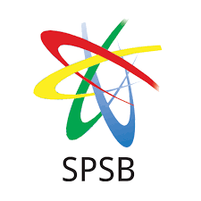

# GSA Bioinformatics Internship
Hi there 👋
Welcome to the official GitHub organization for the GNOBB-SPSB-ASI Bioinformatics Internship, also known as the GSA Bioinformatics Internship. This 6-month hybrid internship program is designed to develop hands-on expertise in bioinformatics through a combination of structured instruction, mentored projects, and collaborative research activities.

## Host Organizations
Global Network of Bangladeshi Biotechnologists (GNOBB), ASI School of Life, and Society for the Popularization of Science, Bangladesh (SPSB)

  
  
  
  

  

  
  
  

